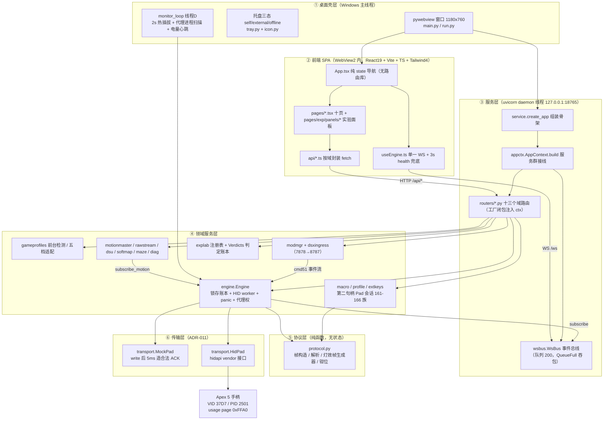
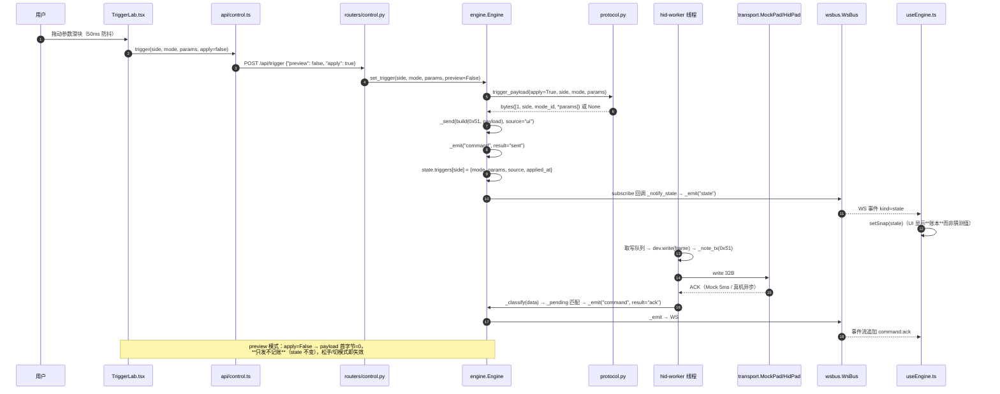
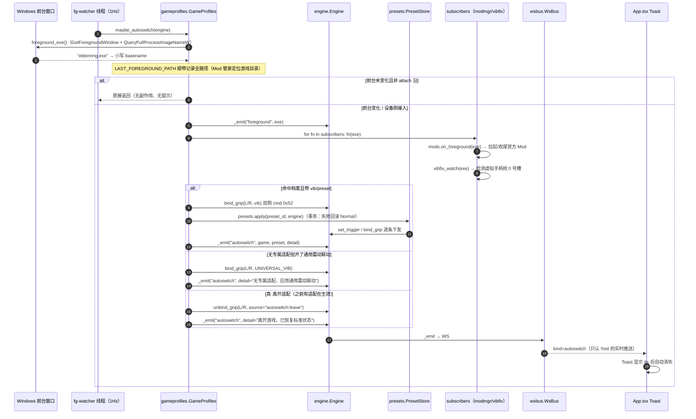
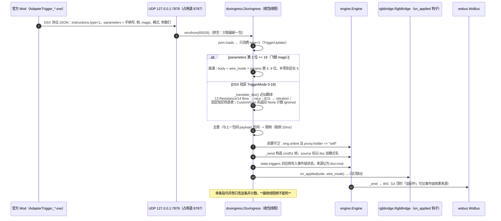
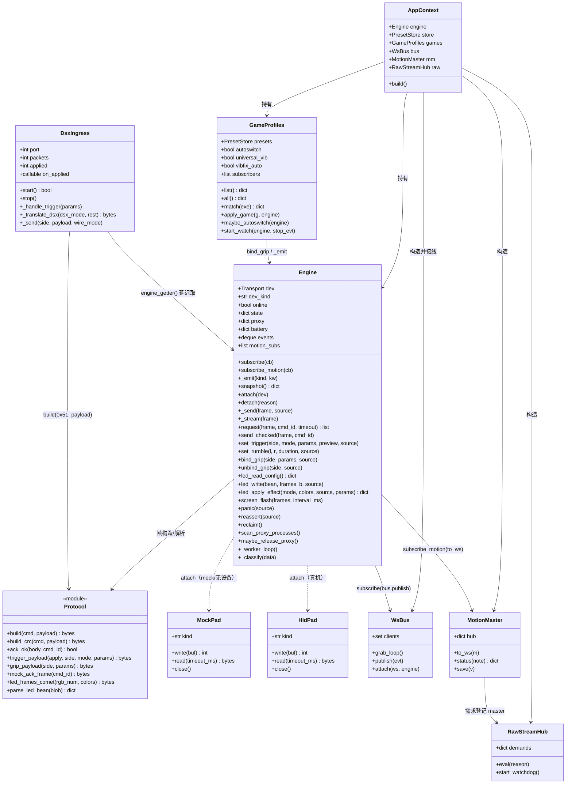

# ARCHITECTURE · Apex5 Unleashed 架构定稿

> **文档性质**：存量项目的架构定稿（retroactive architecture），对齐 v0.3.2（仓库根 `VERSION` 为唯一真相源）。
> 本文回答「**代码怎么组织**」；「做什么 / 为什么做」见 `docs/PRD.md`，「协议字节怎么排」见 `docs/PROTOCOL.md`，
> 「技术参数与线程约定」见 `docs/TECH-SPEC.md`，「逐个决策的来龙去脉」见 `docs/adr/`。
>
> - 写作依据：实际代码（`backend/app/**`、`frontend/src/**`）+ ADR-001~034 + PROTOCOL/TECH-SPEC。
> - 标注约定：**✅ 已实跑核对** / **⚠ 文档与实现有偏差** / **❓ 待核实**。
> - 本文**不立项新功能**。任何结构性变更仍须按 ADR-012 纪律先走 ADR。
> - 配套任务分解见 `docs/TASK-BREAKDOWN.md`。

---

## 1. 架构总览

### 1.1 一句话分层

> **单进程 · 五层**：pywebview 桌面壳（主线程）→ FastAPI 服务层（uvicorn daemon 线程，REST + 单 WS + 静态托管前端产物）
> → 领域服务层（Engine 协议引擎 / 游戏档案 / Mod·ingress / 宏·档案 blob / 体感中心）→ 协议层（纯函数帧构造）
> → 传输层（`MockPad` | `HidPad`），前端 SPA 只经 `127.0.0.1:18765` 与后两层对话。

关键约束：**整进程只有一个 HID 读写线程**（ADR-012，`engine._worker_loop`），
宏/档案/拓展键写入走**第二句柄**（`extkeys.Pad`，Windows 多句柄复制输入，与读线程并存）——
这两条是全局硬约束，任何新增模块都必须遵守。

### 1.2 分层图



### 1.3 线程模型（TECH-SPEC §1 的落地现状）

| 线程 | 名称 | 职责 | 创建处 |
|---|---|---|---|
| 主线程 | `MainThread` | pywebview 窗口消息循环（Windows GUI 必须主线程） | `main.py` `webview.start()` |
| 线程 S | `uvicorn` | REST + WS + 静态托管前端 dist | `main.py`，daemon |
| 线程 H | `hid-worker` | **唯一**读写手柄的线程（读 10ms 超时，写队列 + 流式直写共用写锁） | `engine.attach()` |
| 线程 T | pystray 自带 | 托盘图标与菜单 | `tray.Tray.start()` |
| 线程 D | `monitor` | 2s 热插拔轮询 + 代理进程扫描（10s 节流）+ 30s 电量心跳 | `main.monitor_loop()` |
| 线程 | `fg-watcher` | 1Hz 前台进程检测 → 自动切换档案 | `gameprofiles.start_watch()` |
| 线程 | `dsx-ingress` | UDP 7878/8787 收 DSX 事件流 | `dsxingress.DsxIngress.start()` |
| 线程 | `keymonitor` ×2 | 键盘接口 + 游戏盘接口拓展键监听（非 mock 时） | `main.py` |
| 线程 | `post-attach` / `screen-flash` / `vibfix-boot` | 一次性后台任务 | 各处 `Thread(daemon=True)` |

> **红线**：`ShellExecuteW(runas)` 的 UAC 弹窗会阻塞调用线程 —— vibfix 启动自检必须在后台线程跑（`main._vibfix_boot_check`），
> 否则空间站虚拟手柄在场时整个启动卡死。

---

## 2. 模块结构

### 2.1 后端 `backend/`

```
backend/
├─ run.py                 入口：sys.path 插 app/ 后调 main.main()
├─ run_gui.pyw            无控制台启动（Windows）
├─ requirements.txt       运行依赖（不含 pytest —— 测试依赖另立 requirements-dev.txt）
├─ apex5.spec             PyInstaller onedir 打包（前端 dist 作为 datas 打进 _MEIPASS）
├─ smoke_test.py          Mock 全链路冒烟（**需服务先起**，非 pytest 用例）
├─ test_*.py              14 个测试文件（脚本式 12 + pytest 式 2）
├─ analyze_*.py / capture_*.py / *_probe.py / mapping_*.py / kb_*.py / enum_dev.py
│                         逆向期一次性脚本（**已入库**，见 TASK-BREAKDOWN T02）
└─ app/
   ├─ main.py             进程组装：uvicorn → 端口就绪 → webview + 托盘 + 监控线程
   ├─ service.py          create_app：中间件 + include routers（ADR-029 B8 后仅剩骨架）
   ├─ appctx.py           AppContext.build()：服务群实例化与 engine 订阅接线（**顺序敏感**）
   ├─ wsbus.py            WS 事件总线
   ├─ routers/            十三域路由（见 2.3）
   ├─ engine.py           ★ 协议引擎：锁存账本 + HID worker + panic + 代理权
   ├─ protocol.py         ★ 协议层：帧构造/解析/灯效帧生成器（纯函数）
   ├─ transport.py        ★ 传输层：MockPad / HidPad / find_device_path
   ├─ gameprofiles.py     游戏档案 + 前台自动切换（ADR-014/017/022/024）
   ├─ presets.py          预设库（事务式应用，失败回滚 Normal）
   ├─ officialimport.py   官方 adapterTriggerGames.json 导入器
   ├─ gameimg.py          封面图本地缓存代理（限流预下载 → imgcache/）
   ├─ dsxingress.py       DSX UDP ingress（ADR-025）
   ├─ modmgr.py           官方 Mod 下载/安装/生命周期（ADR-025）
   ├─ macro.py            板载宏（163 blob 偏移 230，ADR-021/032）
   ├─ profile.py          档案 blob 编辑全家桶（turbo/曲线/行程/固件映射/四槽/恢复出厂）
   ├─ extkeys.py          拓展键映射写通路（161-166 族，第二句柄 Pad）
   ├─ extkeymap.py        拓展键键盘映射（0xEF 边沿 + SendInput，ADR-030）
   ├─ keymonitor.py       键盘接口 / 游戏盘接口监听
   ├─ motionmaster.py     体感中心总闸状态机（持久化 + 30Hz WS 节流）
   ├─ rawstream.py        0xEF 位图流需求登记表（按需开流，ADR-028 修订 2）
   ├─ softmap.py          陀螺瞄准 + 摇杆→键鼠（SendInput）
   ├─ dsu.py              DSU/Cemuhook UDP 桥（26760）
   ├─ maze.py             弹珠迷宫（互补滤波姿态解算 v2）
   ├─ rgbbridge.py        DSX RGBUpdate → 灯效（实验项）
   ├─ gamesim.py          模拟游戏场（自环 UDP 打全链路，实验项）
   ├─ devcfg.py           设备设置 + 昵称 + 占用方解析（cmd3/2/16/19-24）
   ├─ diag.py             摇杆诊断采样 + ADC 校准
   ├─ screenpack.py       屏幕图片格式与打包（LVGL v8 头 + RGB565）
   ├─ screenota.py        屏幕串口 OTA 上传
   ├─ vibfix.py           游戏震动修复（UAC 临时/永久 + 账本）
   ├─ sharecode.py        分享码 APX5- 编解码（zlib + base62 + crc16）
   ├─ explab.py           体验区注册表（唯一真相源）+ 判定账本
   ├─ icon.py / tray.py   自绘手柄图标（零版权风险）/ 托盘
   └─ _maze_check.py / _maze_diag.py / _smoke_dsu.py / _ws_check.py
                          一次性诊断脚本（**已入库**，见 TASK-BREAKDOWN T02）
```

### 2.2 前端 `frontend/src/`

| 路径 | 约定 |
|---|---|
| `main.tsx` | 挂载点，仅 15 行 |
| `App.tsx` | **唯一导航容器**：`NAV` 数组定义分组与顺序，`PAGE_META` 定义页标题；纯 `useState` 切换，无路由库 |
| `useEngine.ts` | **唯一 WS 消费点**：首帧 snapshot → 增量事件；`device`/`battery`/`state` 事件原地合并进 snapshot，`motion` 事件**只进 `motionStore`**（30Hz 渲染会卡死页面），其余进 events（保留最后 200 条）；断线 3s 重连 + 3s `/api/health` 兜底轮询 |
| `motionStore.ts` | 普通对象（非 React state），供 rAF 物理循环直读 |
| `api/*.ts` | 按域拆分：`system` `control` `games` `presets` `macros` `lights` `screen` `motion` `exp` `settings`；`http.ts` 统一 fetch 封装，`types.ts` 统一 TS 类型 |
| `hooks/usePolling.ts` | 轮询 hook（游戏库 3s 等） |
| `pages/*.tsx` | 十个正式页面，与 `App.NAV` 一一对应 |
| `pages/exp/panels/*.tsx` | 体验区面板，**由 `explab.py` 注册表驱动**，前端只渲染不硬编码清单 |
| `components/` | `StatusBanner`（离线横幅）、`Toast`（自动切换提示）、`rangeFill`（滑块填充） |
| `Offline.tsx` | `DeviceGate`：灯光/屏幕等真机依赖页离线不可操作 |
| `index.css` | Tailwind 4 token + 手写组件类（`.btn` `.tag` `.card` 等），不引 shadcn CLI（ADR-004） |

> 目录惯例：**新页面**放 `pages/` 并同时在 `App.tsx` 的 `NAV` + `PAGE_META` 登记；
> **新实验功能**只加 `backend/app/explab.py` 的 `FEATURES` 条目 + `pages/exp/panels/` 面板 + `/api/exp/*` 前缀端点。

### 2.3 路由总表（按域，均经 `routers/build_*_router(ctx)` 工厂注入）

| 域 | 文件 | 主要端点 |
|---|---|---|
| 系统 | `routers/system.py` | `/api/health` `/api/version` `/api/device` `/api/state` `/api/modes` `/api/show` `/api/ui-error` `/api/open-folder` `/favicon.ico` |
| WS | `routers/ws.py` | `/ws`（主体在 `wsbus.WsBus.attach`） |
| 控制 | `routers/control.py` | `/api/trigger` `/api/trigger/clear` `/api/rumble` `/api/grip` `/api/grip/unbind` `/api/panic` `/api/proxy/reclaim` |
| 灯光 | `routers/led.py` | `/api/led/{test,config,apply,apply_frames,backup,restore}` |
| 屏幕 | `routers/screen.py` | `/api/screen/{convert,status,flags,animation,statusbar,flash}` |
| 拓展键 | `routers/extkeys.py` | `/api/extkeys` `/api/extkeys/testmode` `/api/extkeys/mapping` |
| 宏 | `routers/macro.py` | `/api/macro/{config,write,record/*,backup,restore}` |
| 预设 | `routers/presets.py` | `/api/presets` `/api/presets/{pid}/apply` |
| 游戏 | `routers/games.py` | `/api/games`（CRUD）`/api/games/{gid}/{apply,exe,link}` `/api/games/import-official` `/api/games/official-src` `/api/vib/universal` `/api/autoswitch` `/api/game-img/{gid}` `/api/imgcache/*` |
| 设置 | `routers/settings.py` | `/api/vibfix*` `/api/mods*` `/api/settings/autostart` |
| 测试台 | `routers/testbench.py` | `/api/test/{pulse,sine,attrib,keymap}` |
| 体验区 | `routers/explab.py` | `/api/exp/**` 共 35 个端点（profile/slots/devcfg/owner/gyro/stickmap/rgbbridge/maze/dsu/sharecode/diagnostics/factoryreset） |
| 体感 | `routers/motion.py` | `/api/motion/master` `/api/rawstream` + 6 个 `/api/exp/*`（imu / gamesim / rgbbridge flash+test） |

---

## 3. 关键数据流

### 3.1 ① 扳机调参写入链路（preview 不落账本）



### 3.2 ② 游戏前台切换 → 档案套用



### 3.3 ③ DSX Mod ingress 事件翻译



### 3.4 ④ WS 状态推送

```mermaid
sequenceDiagram
    autonumber
    participant E as engine（hid-worker / monitor / fg-watcher 线程）
    participant SUB as engine._bus 订阅者列表
    participant BUS as wsbus.WsBus
    participant LOOP as asyncio 事件循环（uvicorn 线程）
    participant Q as asyncio.Queue(maxsize=200)
    participant WS as routers/ws.py /ws
    participant FE as useEngine.ts

    Note over E,FE: 连接建立
    WS->>BUS: bus.attach(ws, engine)
    BUS->>Q: 新建队列并注册到 clients
    BUS-->>FE: 首帧 {"kind":"snapshot", **engine.snapshot()}（含最近 80 条 events）
    FE->>FE: events 打 hist=true（重连重放的历史不弹 toast）

    Note over E,FE: 运行期
    E->>E: _emit(kind, **kw) → events.append + 遍历订阅者
    E->>SUB: bus.publish(evt)（注册顺序：bus.publish **先于** macro.RECORDER.on_event）
    BUS->>LOOP: loop.call_soon_threadsafe(deliver)（跨线程安全）
    LOOP->>Q: q.put_nowait(evt)（QueueFull → 静默吞包，行为约束勿改）
    WS->>Q: await q.get()
    WS-->>FE: ws.send_text(json.dumps(evt))
    FE->>FE: 按 kind 分流：state/device/battery → 合并进 snap；<br/>motion → motionStore；其余 → events（留 200 条）

    Note over BUS: 体感帧例外：MotionMaster.to_ws 自己 30Hz 节流后调 bus.publish，<br/>且总闸关闭时静默（流仍在跑，喂拓展键/宏录制）
```

---

## 4. 关键数据结构与接口

### 4.1 帧格式（**规范以 `docs/PROTOCOL.md` 为准，此处只摘录接入点**）

| 项 | 取值 | 代码位置 |
|---|---|---|
| VID/PID | `0x37D7` / `0x2501` | `protocol.VID/PID` |
| vendor 接口 | usage page `0xFFA0` | `protocol.USAGE_PAGE_VENDOR` |
| 输出帧 | 32B：`03 5A A5 <cmd> <len> <payload…>` | `protocol.build(cmd, payload)` |
| 输入帧 | report id `0x04`；剥头后 `[2]=cmd, [3]=01` 为成功 | `protocol.ack_ok(body, cmd)` |
| 带 CRC 帧 | 灯光族：`len = payload+2`，`CRC = sum(frame[3:3+len]) & 0xFF` | `protocol.build_crc(cmd, payload)` |
| 81/82/18 | 官方本就不带校验和 | `protocol.build()` |

常用命令号常量：`CMD_INFO=0x01`、`CMD_STATUS=0x03`、`CMD_SETTING=0x13(19)`、`CMD_RUMBLE=0x12(18)`、
`CMD_TRIGGER=0x51(81)`、`CMD_GRIP=0x52(82)`、`CMD_LED_READ=0xA7(167)`、`CMD_LED_WRITE_START=0xA8(168)`、
`CMD_LED_WRITE_PACK=0xA9(169)`、`CMD_LED_TEST=0xF5(245)`；宏/档案族 161-166 走 `extkeys.Pad` 第二句柄。

### 4.2 锁存账本 `Engine.state`

> 语义：**先记账再发送，UI 看账本不看猜测值**（ADR-006/013）。夺回代理权时 `reassert()` 把账本原样重发。

```python
state = {
  "triggers": {                      # 扳机
    "left":  {"mode": str, "params": dict, "source": str, "applied_at": "HH:MM:SS"} | None,
    "right": {...} | None,
  },
  "rumble":   {"l": 0..255, "r": 0..255, "updated_at": str|None},
  "gripBind": {"left": {filter,scale,stroke,press,strength,freq, source, applied_at} | None,
               "right": {...} | None},
}
```

`source` 是人话事实记录，前端靠它推导适配状态：`game:<名称>` / `game:<名称>:novib` / `preset:<名称>` /
`vib:universal` / `dsx:mod` / `ui` / `panic` / `test` / `reclaim` / `autoswitch:leave`。

### 4.3 代理权模型 `Engine.proxy`

```python
proxy = {"holder": "self" | "external", "detail": str, "since": "HH:MM:SS", "mild": bool}
```

| 机制 | 规则 | 代码 |
|---|---|---|
| 接管铁证 | **只信总线**：不匹配本方 `_pending` 的 ACK/回显，且 `REPLY_GRACE=5s` 内本方任何句柄都没发过同 cmd | `engine._classify` → `_external_hit` |
| 孤儿 ACK 吸收 | 多包读第 2..N 包、迟到 ACK、第二句柄回复 → 只记 `_orphan_replies[cmd]`，**不算外部** | `_last_tx` + `extkeys.last_tx()` 宽限窗 |
| 进程归因 | `tasklist` 10s 节流，只补名字，**不单独判定接管** | `scan_proxy_processes()` |
| init 指纹 | 10s 窗口内命中 ≥3 种 `SS_INIT_MARKERS` → `mild=True`，代理权仍 external（收回/重放照旧），仅 UI 柔化为中性提示 | `SS_INIT_MARKERS`（ADR-023） |
| 自动收回 | 外部空闲 `PROXY_RELEASE_TIMEOUT=15s` → `_reclaim()` + `reassert()` 重放账本 | `maybe_release_proxy()` |
| 手动夺回 | `POST /api/proxy/reclaim` | `reclaim()` |
| 离线复位 | `detach()` 无条件复位为 self（否则横幅永久卡「被接管」） | `detach()` |

### 4.4 核心类关系



### 4.5 其他关键约定

| 约定 | 值 / 规则 |
|---|---|
| 命令超时重试 | `ACK_TIMEOUT=0.3s`，`ACK_RETRY=2`（超时**只记失败不盲目重发**） |
| pending 结构 | `{cmd: deque[[deadline, retries, meta]]}`，FIFO 逐个匹配（同 cmd 连发不互相覆盖） |
| 外部命令冷却 | `EXTERNAL_COOLDOWN=60s`（抑制刷屏，时间戳仍刷新） |
| 灯表槽位 | `LED_SLOT_BYTES=360`；写入前按 `rgb_num*3` 显式裁剪，`truncated` 进事件与返回值 |
| 电量 | cmd1 心跳回复 `body[11]`：低半字节 0..5，高半字节 1=充电中；**手柄静默 60s 停发心跳**（否则固件永不休眠） |
| 数据目录 | `%APPDATA%\Apex5Unleashed\`：`settings.json` `presets/` `games/` `mods/` `imgcache/` `led_backup.bin` `exp_verdicts.json` `motion_hub.json` `vibfix.json` `backup_<ts>/` `apex5.log` `proxy_hits.log` |
| 版本唯一真相源 | 仓库根 `VERSION`（`/api/version` 读取，frozen 下打进 `_MEIPASS`）；`GIT_SHA` 由 CI 落盘区分 nightly |

---

## 5. 跨文件共享知识（工程师必读）

### 5.1 命名约定

- 后端模块：全小写无下划线连写（`gameprofiles`、`dsxingress`、`motionmaster`）；**一次性/私有脚本**用 `_` 前缀（`_maze_check.py`）。
- 路由函数：`build_<域>_router(ctx)` 工厂闭包注入，端点函数内**延迟 import**（ADR-029 纪律：函数内 import 保持原位，不要提升到模块头）。
- 前端：页面组件 PascalCase 文件（`TriggerLab.tsx`），API 按域小写（`api/games.ts`），实验面板放 `pages/exp/panels/`。
- 事件 `kind`：`snapshot` `device` `state` `command` `battery` `versions` `proxy` `extkey` `rawhid` `panic` `error` `info` `foreground` `autoswitch` `screen` `led` `vibfix` `owner` `raw_motion` `motion`。
- `source` 字段是**工具行为的事实记录**，UI 靠它推导状态，新增来源请沿用 `<域>:<标识>` 格式。

### 5.2 错误处理约定

- 路由层：统一 `try/except → routers/common.err(e)`，返回 `JSONResponse({"error": str}, 400)`。
- 需要真机的操作：先 `routers/common.require_real(engine)`（mock 模式直接抛「此操作需要真机连接」）。
- 阻塞问答统一走 `engine.send_checked(frame, cmd_id)` —— 无 ACK 抛错，**杜绝静默失败**。
- HID 异常 → `detach()`，由 `monitor_loop` 2s 轮询重连。
- 引擎线程里的回调一律包 `try/except`，**单个订阅者异常不得带崩事件分发**。

### 5.3 写操作确认闸门（交互红线，ADR-010 起源）

> 硬件写入不可逆且可能残留效果。任何写设备/改系统的操作都必须**可确认、可回退、可追溯**。

| 操作 | 闸门 | 代码位置 |
|---|---|---|
| 屏幕 GIF 烧写 | `confirm=true` 必填，缺则后端直接拒绝 | `routers/screen.py` |
| 重置档案槽 / 整机重置 | 字符串双确认 `RESET` / `RESET-ALL` + **`common.full_backup()` 全量备份先行**（四槽 blob + 灯表 + README.txt） | `routers/explab.py` |
| 板载宏写入 / 恢复 | 确认弹窗 + 备份；恢复限定宏区作用域，不整槽回写 | `routers/macro.py`、`macro.py` |
| 灯表写入 | 备份/还原常驻；进页自动还原当前灯效；写后读回自校验，不符重试一次 | `engine.led_write` |
| 拓展键映射写固件 | 跳过宏占用键，返回值回显 `skipped`，UI 标注「宏占用」 | `macro.write`、`extkeys.set_targets` |
| 虚拟手柄禁用（震动修复） | 必须过 UAC；默认**临时**修复（哨兵退出自还原）；永久禁用只在设置页显式点击；全程写 `vibfix.json` 账本 | `vibfix.py` |
| 兜底 | 「手柄复位（panic）」全页常驻：马达归零 + 双扳机回 Normal | `App.tsx` → `POST /api/panic` |

### 5.4 日志约定

- 每条下行命令四元组：**时间 / 来源 / hex / 结果**（`sent` / `ack` / `nack` / `timeout`），内存 `events`（deque 500）+ WS 双通道。
- 罕见事件落盘：外部命令命中写 `%APPDATA%\Apex5Unleashed\proxy_hits.log`；体感总闸请求探针写 `motion_api.log`。
- 运行日志：`%APPDATA%\Apex5Unleashed\apex5.log`（README 已告知用户）；启动耗时走 `[boot]` 前缀。
- **高频数据不进事件日志**：0xEF 运动帧走 `subscribe_motion`（不 `_emit`），体感 WS 推送再 30Hz 节流。

### 5.5 其他硬约束

- 缓存头：`/api/*` 一律 `no-store`，`index.html` 一律 `no-cache`（WebView2 启发式缓存会喂死状态）。
- WebView2 必须 `--no-proxy-server`（用户系统代理半死时带 body 的 POST 永不返回）。
- 单实例：探测 `/api/health` → 调 `/api/show` 唤起已有窗口后退出；绑定失败重试 12s，绝不「带病开窗」。
- favicon 必须全内存生成，**禁止碰 `app.ico` 文件**（与窗口 `Icon(path)` 撞车会 GIL 僵死）。
- `appctx.AppContext.build()` 的订阅顺序是行为约束（`bus.publish` 先于 `macro.RECORDER.on_event`），勿调。

---

## 6. 依赖包与技术约束

### 6.1 后端（Python 3.13，`backend/requirements.txt`）

| 包 | 用途 | 备注 |
|---|---|---|
| `fastapi` | REST + WS 服务层 | `docs_url/redoc_url` 已关闭 |
| `uvicorn` | ASGI 服务器（daemon 线程） | 绑 `127.0.0.1:18765` |
| `websockets` | WS 依赖 + `smoke_test.py` 客户端 | |
| `pydantic` | 请求体校验（各 router 内 `BaseModel`） | |
| `hidapi` | 真机 HID vendor 接口（`transport.HidPad`） | 缺失时 `find_device_path()` 静默返回 None → 自动 Mock |
| `pystray` | 托盘（自带消息循环） | 不可用时静默忽略 |
| `Pillow` | 自绘手柄图标（窗口/托盘/favicon 同源） | |
| `pywebview` | 桌面壳（Windows 走 WebView2） | 主线程阻塞；`--no-gui` 时完全不 import |

打包：`PyInstaller` onedir（`backend/apex5.spec`），前端 `dist` 作为 datas 打进 `_MEIPASS/frontend/dist`。
测试依赖（`pytest`）**不进运行 requirements**，应另立 `backend/requirements-dev.txt`。

### 6.2 前端（Node 24，`frontend/package.json`）

| 包 | 版本 | 用途 |
|---|---|---|
| `react` / `react-dom` | ^19.2 | UI |
| `vite` + `@vitejs/plugin-react` | ^8.3 / ^6.1 | 构建（dev 态 proxy `/api`、`/ws` → 18765） |
| `tailwindcss` + `@tailwindcss/vite` | ^4.3 | 样式（token 在 `index.css`） |
| `lucide-react` | ^1.47 | 图标 |
| `matter-js` | ^0.20 | 弹珠迷宫物理 |
| `typescript` | ~6.0 | `npm run build` = `tsc -b && vite build` |
| `oxlint` | ^1.81 | `npm run lint` |

### 6.3 平台约束

- **仅 Windows**：`ctypes.windll`、pystray、UAC、任务栏 AUMID、`tasklist` 进程扫描均为 Windows 专有。
- 仅支持 **Apex 5 / k5**（ADR-002）：不追八6 X-Haptics，不碰已判死命令（cmd 87 / 172-174 / 208-211 等）。
- 全局测试环境**只有 1 个手柄**（RISK R4）→ 一切新增能力必须能在 Mock 层跑通（ADR-011）。

---

## 7. 已发现的文档 ↔ 实现偏差（供规范化参考）

> 状态图例：**已修正** = 对应文档已改好；**待改** = 仍需工程师处理；❓ = 待拍板。
> 本表由架构师（2026-10-06 代码核对）建立；D1/D9 的 PRD 侧已于同日由产品经理回修。

| # | 偏差 | 现状 | 状态 / 建议 |
|---|---|---|---|
| D1 | `TECH-SPEC §6` 写「WS 10Hz 合并推送」 | ✅ 实现是**逐条转发**（`wsbus.publish` → `loop.call_soon_threadsafe` → `q.put_nowait`；`attach` 里逐条 `send_text`），无合并层；唯一节流在 `motionmaster.to_ws()`（30Hz） | **PRD 侧已修正**（§4.2 / P0-13 改为「快照 + 逐条事件推送，体感帧 30Hz 节流」）；**`TECH-SPEC §6` 仍待改**（T01 顺手改）。语义结论：不合并是更优设计（命令 ACK 实时可见），属产品约束非缺陷 |
| D2 | `TECH-SPEC §8` 写「四页」 | ✅ 实际十页 + 体验区面板（PRD §4.2 描述正确） | 待改：改文档或标注为 v0.1 快照 |
| D3 | `TECH-SPEC §1` 线程表未含 `fg-watcher` / `dsx-ingress` / `keymonitor` | ✅ 实际有 | 待改：补表 |
| D4 | `PROTOCOL.md` 引用 `../../ANALYSIS.md` | ❓ 该文件在**仓库之外**的上级工作区，克隆者拿到死链 | 待拍板：把结论搬进 `docs/` 或改措辞（T01.6，默认改措辞） |
| D5 | `RISK-REGISTER` R8 应对栏写「已建制度」并指向 DEV-STATUS | ❌ `docs/DEV-STATUS.md` 不存在 | 待改：补建（TASK-BREAKDOWN T01.1） |
| D6 | `ADR-INDEX.md` 只写到 ADR-030 | ❌ 实际已有 031/032/033/034 | 待改：补条目（T01.2） |
| D7 | `README.md` 文档索引缺 PRD / RESEARCH / ARCHITECTURE / TASK-BREAKDOWN / DEV-STATUS | ❌ | 待改：补（T01.5） |
| D8 | `smoke_test.py` 命中 pytest 默认 `*_test.py` 收集规则，且**在 import 期就发真实 HTTP/WS 请求** | **✅ 已根治（2026-10-06 T03.2 落地后复验）**：新增 `backend/conftest.py`（`collect_ignore_glob=["smoke_test.py"]` + 绝对路径 `collect_ignore` 双保险），
实测 `python -m pytest backend -q` → **全绿且收集阶段不再被打断**（核对时刻：2026-10-06，当时 **`35 passed in 4.69s`**；
数字会随 T04 推进继续上涨，**判断标准是「全绿且无 `Interrupted`」，不是某个固定条数**）。冒烟改走 `tools/run_smoke.py`（自动起 Mock 服务 → 跑冒烟 → 收尾杀进程） | 已闭环。**`backend/conftest.py` 必须留在 `backend/`**（pytest 测试根），**不能**放 `backend/app/`——app 是被 `sys.path.insert` 塞进来的模块目录。⚠ 中途快照作废：本条曾在同日早前被复验为「仍未落地」（当时 `conftest.py` / `run_smoke.py` / `ci.yml` / `requirements-dev.txt` 全 MISSING），**以本行最新时间戳与复跑结果为准** |
| D9 | 旧文档把测试资产写作 `backend/tests/` | ❌ 该目录**不存在**；实际是 `backend/test_*.py` + `backend/smoke_test.py` 平铺在 backend 根 | **PRD 侧已修正**（P1-10 路径改正并补「三形态并存」说明）。架构侧口径（2026-10-06 复跑）：**35 个 pytest item**
（`test_protocol_units` 20 + `test_dsx_mod` 9 + `test_rawstream` 6）+ **11 个脚本式自检**
（模块级 assert，`python test_x.py` 单独跑）+ 1 个全链路冒烟（`tools/run_smoke.py`）。
⚠ 该口径**一天内已翻两次**（15 → 35），引用前请自行复跑 `python -m pytest backend -q` |

---

## 8. 待明确 / 待核实

1. ❓ **远端 Release 现状**（PRD §6 Q7 同议题）：本地 `git tag` 只有 `v0.1.0` 与 `safe-20261006-pre-standardization`，但 `release.yml` 会在 VERSION bump 且远端无同名 tag 时**自动**发正式版 —— 远端是否已有 v0.2.x/v0.3.x 需联网核实（`git ls-remote --tags origin` / `gh release list`）。当前沙箱无网络，未能核实。打 tag 不可逆，核实前禁止执行。
2. ❓ **顶层 `../../PROJECT.md`、`../../ANALYSIS.md`** 属仓库外工作区产物，是否搬运进 `docs/`（涉及内容版权与体积）。
3. ❓ `frontend/.design-refs/`（6 张竞品 UI 截图）与 `frontend/_patch_sliders.py`、`backend/app/_*.py` 的归属（移 `tools/` 还是 `.gitignore`）。
4. ❓ 前端是否需要 chunk 拆分（当前 515KB 单 chunk 触发 Vite 500KB 告警）——改构建配置属行为无关变更，但有回归风险。
5. ❓ `docs/TEST-PLAN.md` v0.2/v0.3 验收条目需产品经理/维护者确认条目清单（本文只给骨架与来源）。
6. ~~❓ 测试资产规范化路径~~ **已拍板（PM 2026-10-06，见 PRD P2-9 / §6 Q8 与 TASK-BREAKDOWN Q11）**：
   ① 11 个脚本式自检**按可离线程度分类处理**（`test_led.py` 类纯 Mock → pytest 化纳 CI；`test_grip_real.py` 类依赖运行中服务+真机 → 保留手动形态 + marker 跳过），**不做一刀切**；
   ② `smoke_test.py` **不改名**，只靠 `backend/conftest.py` 排除 —— 理由是 T03.3 的 wrapper `subprocess.run([..., "backend/smoke_test.py"])` 已把路径写死，改名要多动一处引用（**原「README 已写出去该跑法」的理由经实跑核实不成立，已作废**）。
