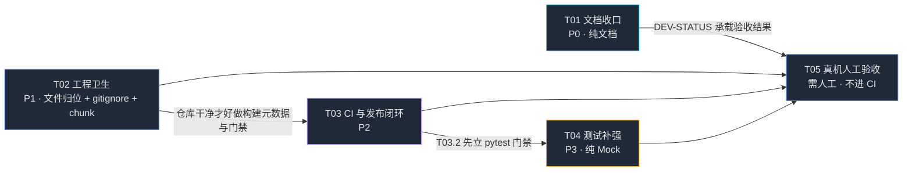

# TASK-BREAKDOWN · 规范化改造任务分解

> **配套文档**：`docs/ARCHITECTURE.md`（架构定稿）、`docs/PRD.md`（需求基线）、`docs/RISK-REGISTER.md`、`docs/TEST-PLAN.md`。
> **版本基线**：v0.3.2（`VERSION` 为唯一真相源）。
>
> ## 全局纪律（所有任务适用）
>
> 1. **本次是规范化改造，严禁改动业务行为** —— 不改协议逻辑、不改 UI 功能、不改路由语义、不改线程模型。
>    唯一允许的例外在 T03.3（测试脚本适配 CI，纯测试侧）。
> 2. **安全点已建**：`c94f092` / tag `safe-20261006-pre-standardization` / 分支 `backup/pre-standardization-20261006`。
>    任何改动出问题：`git reset --hard safe-20261006-pre-standardization`。
> 3. **按任务顺序执行**，每个任务完成后单独提交（commit message 用 `docs(chore):` / `chore(hygiene):` / `ci:` / `test:` 前缀），
>    不要把五个任务混成一个 commit —— 出问题时才能精确回退。
> 4. **真机标记**：标注「需人工」的任务**不进 CI**，且不得在没有手柄的机器上执行；标注「纯 Mock」的必须能在 CI 上跑通。
> 5. 每完成一个任务，同步更新 `docs/DEV-STATUS.md`（由 T01.1 创建）的对应状态行。
> 6. **状态标注纪律（本次改造的元目标）**：本项目本次要治的病就是「文档与实跑不符」，
>    **写状态文档时不得把「计划做」写成「已做」**。约定：
>    - 每个 ✅ / 「已完成」必须**配一条可当场复跑的验证命令**（例：D8 标 ✅ 的前提是
>      `python -m pytest backend -q --collect-only` 不再报 `Interrupted`，且 `backend/conftest.py` 存在）。
>    - **状态锚点必须带「时间戳 + 复跑命令」**：任何「XX 文件 MISSING / XX 已落地」的判断都要写上核对时刻和那条能复现的命令，
>      **引用者一律以自己重跑的结果为准，不要信某一版快照**。滚动推进的改造里，几分钟前的负面结论就可能变成错误信息源
>      （本轮实例：D8 曾在同一天早前被复验为「仍未落地、五个文件全 MISSING」，T03.2 落地后更正为「已根治、15 passed」，
>      T04.1 落地后再更正为当前的 `35 passed`——**一天内翻了两次**）。
>    - **发给执行方的修正 / 待办清单必须标注「所基于的 commit 或复跑时刻」，并要求执行方动手前先复跑一次基准命令。**
>      信息有时效，而清单是按某一版快照生成的；不标时刻，清单本身就会变成错误信息源
>      （本轮实例：架构师曾发出一份 7 处修正清单，其中 4 条在 T03 落地后作废，照着做会把对的改错）。
>    - 未落地的项一律写 ⬜ / 「计划」，**禁止**预写 ✅。
>    - 状态表建议加一列 **「验证方式」** 或把 ✅ 拆成 ✅已落成 / 🕐计划中。
>    - **「已落地」≠「已落库」**：功能可用与成果受版本控制保护是两件事，验收与交接时**必须分别确认**。
>
>    **本表当前状态锚点（2026-10-06 复跑，HEAD=`c94f092`）**：
>    `backend/conftest.py` ✅ · `tools/run_smoke.py` ✅ · `tools/run_script_tests.py` ✅ ·
>    `backend/requirements-dev.txt` ✅ · `.github/workflows/ci.yml` ✅ · `docs/RELEASE.md` ✅ ·
>    `backend/test_protocol_units.py` **✅ 已落地（20 个 test 函数）** ·
>    `python -m pytest backend -q` → **`35 passed in 4.69s`**（`test_protocol_units` 20 + `test_dsx_mod` 9 + `test_rawstream` 6）。
>    **落库状态：❌ 全部未 commit** —— 上述成果均在未提交区，唯一受版本控制的锚点仍是改造前打的
>    `safe-20261006-pre-standardization`。见下方「前车之鉴」与 T05 交接检查。
>
>    > 前车之鉴（2026-10-06，同一天内的三次快照）：
>    > ① `docs/DEV-STATUS.md` 首版把 T03 / T04.1 / D8 全部标 ✅，实跑核实是五个交付文件全 MISSING、
>    >   `pytest backend -q` 输出与改造前一字不差（`15 tests collected, 1 error`）→ 文档一度成「计划态」；
>    > ② T03.2 落地后更正为「D8 已根治、15 passed、只剩 T04.1」；
>    > ③ T04.1 落地后再更正为「35 passed、T01–T03 全部落地」。
>    > 三段记录**全部保留**，不抹掉任何一版——保留更正史正是为了让下一个引用者知道「这份判断是会翻的，先复跑」。

---

## 任务总览

| 任务号 | 目标 | 优先级 | 依赖 | 需真机 | 预估改动量 |
|---|---|---|---|---|---|
| **T01** | 文档收口（DEV-STATUS / ADR-INDEX / TEST-PLAN / RISK-REGISTER / README 索引 / 死链） | **P0** | — | 否 | 6 个文件（1 新建 5 改） |
| **T02** | 工程卫生（临时脚本与素材归属、.gitignore 核查、前端 chunk 拆分） | **P1** | —（可与 T01 并行） | 否 | 6~10 个文件（多为移动/删除）+ 2 处配置 |
| **T03** | CI 与发布闭环（测试门禁 + smoke 脚本化 + 发版 SOP） | **P2** | T02 | 否 | 2~3 个新文件 + release.yml |
| **T04** | 测试补强（最该补测的模块与用例，全部纯 Mock） | **P3** | T03.2 | 否（trace 录制除外） | 3~5 个新测试文件 |
| **T05** | 真机人工验收清单（不进 CI） | P1 | T01 + 全部改造完成 | **是（需人工）** | 1 个文档（DEV-STATUS 追加） |

---

## T01 · 文档收口（P0，纯文档，无需真机）

**目标**：把「文档滞后于代码」的欠账一次性还清，让新人（以及 6 个月后的自己）能靠仓库内文档独立上手。
**原则**：只改文档，**一行代码都不动**；所有结论从代码和现有 ADR 正文抄，**不得凭空改写 ADR 结论**。

### T01.1 新建 `docs/DEV-STATUS.md`（RISK R8 的锚点，当前根本不存在）

- **涉及文件**：新建 `docs/DEV-STATUS.md`
- **必含章节**：
  1. 当前版本与来源（`VERSION` = 0.3.2，`/api/version`；构建元数据 `GIT_SHA`）
  2. 安全点与回退方式（`git reset --hard safe-20261006-pre-standardization`）
  3. 已实现能力清单（指向 PRD §3 需求池 + 附录 A「能力域 → 模块/ADR 速查」，**不复制**）
  4. 当前进行中 / 下一步（README「下一步」四项 + PRD §6 待确认 Q1 的当前决定）
  5. 已知问题与坑位（指向 PROTOCOL §已知坑、RISK-REGISTER 未消除项、ARCHITECTURE §7 文档/实现偏差表）
  6. 本地开发起法与测试跑法（`python backend/run.py --mock`、`python -m pytest backend -q --ignore=backend/smoke_test.py`、脚本式单测逐个跑）
  7. **真机验收记录表**（留给 T05 填写：日期 / 固件版本 / 条目 / 结果）
- **验收**：文件存在且 7 个章节齐全；`RISK-REGISTER.md` R8 的应对栏能指向到具体章节。
- **风险**：容易写成流水账。**必须是指南不是日记** —— 每条都要能回答「我现在该怎么办」。

### T01.2 补 `docs/adr/ADR-INDEX.md` 的 ADR-031 / 032 / 033 / 034

- **涉及文件**：改 `docs/adr/ADR-INDEX.md`
- **做法**：照 022-030 的**单行压缩式**（`- **ADR-0XX** 文件名：背景 → 决定 → 后果`），从四份 ADR 正文
  （`ADR-031-extkey-first-class.md`、`ADR-032-macro-ownership.md`、`ADR-033-comet-effect.md`、`ADR-034-led-customization.md`）
  各压成 1~3 行，追加到 ADR-030 之后。**编号连续到 034 且不得改旧条**。
- **要点不得丢**：031 拓展键一等键（默认全 255 透传、不别名）；032 键表单一所有权（宏 > 映射，删宏自动回落）；
  033 灯表槽位 10 帧容量 + 静默截断实锤；034 灯效参数化模板 + 帧画布 + 明确非目标（不做规则积木编辑器）。
- **验收**：`grep -c "ADR-0" ADR-INDEX.md` 覆盖 001-034；四段结论与 ADR 正文逐条对得上。
- **风险**：压缩时漏掉「非目标」条款会让后来者误判范围 —— 034 的非目标必须保留。

### T01.3 补 `docs/TEST-PLAN.md` 的 v0.2 / v0.3 验收条目

- **涉及文件**：改 `docs/TEST-PLAN.md`
- **做法**：保留 v0.1 十条（已通过，标注「v0.1 已通过」），新增两节：
  - **v0.2 验收**：官方 Mod 管家闭环（下载/安装/启用/前台拉起/退出收尾）、DSX ingress 收包（飞智包直通 + DSX 社区包翻译）、
    游戏震动修复（临时/永久 + 账本留痕）、游戏库五档适配命中。
  - **v0.3 验收**：体感四件套（陀螺瞄准 / 固件陀螺映射 / DSU 桥 97Hz / 迷宫）、灯光工坊（进页还原 + 外来灯效逐帧回放 + 关灯 + 备份还原）、
    拓展键映射与宏完善（键表所有权、宏占用锁定）、Windows 打包发布（zip 解压即用）。
  - 每条格式照 v0.1：**条目 / 方法 / 通过标准**，并标注 **是否需真机**。
  - 「CI 策略」小节更新落地状态：协议引擎单测 ✅（T03.2 后）、trace 回放 ⬜（T04.x，仍需一次真机录制）。
- **验收**：v0.2/v0.3 两节条目齐全且每条都标了「需真机 / 纯 Mock」；需真机的条目在 T05 清单里有对应行。
- **风险**：条目清单建议与产品经理对齐后再落（PRD §6 Q1 相关），避免写出无法执行的标准。

### T01.4 更新 `docs/RISK-REGISTER.md` 到 v0.3

- **涉及文件**：改 `docs/RISK-REGISTER.md`
- **逐条修订**：
  | # | 现状 | 改为 |
  |---|---|---|
  | R4 | 「Mock 已入 v0.1」 | 应对补：trace 回放**未落地**，挂 `transport.py` 同层（ADR-011 已预留）；状态改「Mock 已入 v0.1，trace 回放待办（PRD P2-6）」 |
  | R6 | 「待做」 | 保持待做但补责任人语境：需真机探针压测（**需人工**，不进 CI，见 T05）；等级可维持「中」 |
  | R8 | 「已建制度」（但 DEV-STATUS 不存在） | 改为「DEV-STATUS 锚点已建（`docs/DEV-STATUS.md`，见 T01.1）」 |
  | R9 | 「待写」 | 改为「README 待补电机寿命/续航提示（PRD P2-8）」或若 T01.5 顺手补文案则改「已执行」 |
  | R13 | 「搁置（UDP ingress 随桥接删除后待定）」 | **ingress 已由 ADR-025 落地**，改为「进行中：当前仅 7878→8787 退让，占用方识别待做（PRD P2-5）」 |
  - 表头补一句「最后评审：v0.3.2」。
- **验收**：R8 指向的文件真实存在；R13 描述与实际代码（7878/8787 退让已实现）一致。
- **风险**：不要把 R1/R5/R7（已消除）改回未消除；它们随 ADR-020 删除已闭环。

### T01.5 `README.md` 文档索引同步

- **涉及文件**：改 `README.md`
- **做法**：「## 文档」一行改为清单式，至少含：
  `docs/PRD.md`（需求基线）、`docs/ARCHITECTURE.md`（架构）、`docs/TECH-SPEC.md`、`docs/PROTOCOL.md`、
  `docs/DEV-STATUS.md`（当前状态锚点）、`docs/TEST-PLAN.md`、`docs/RISK-REGISTER.md`、`docs/TASK-BREAKDOWN.md`（任务分解）、
  `docs/RESEARCH-HIDDEN-FEATURES.md`、`docs/REFERENCES.md`、`docs/adr/`。
  顺手在「快速开始」补一行开发者跑测试的命令（与 T01.1 §6 一致）。
- **验收**：索引里每个链接都能打开（相对路径正确）；无死链。
- **风险**：无（纯文案）。

### T01.6 处理 `docs/PROTOCOL.md` 的仓库外死链

- **涉及文件**：改 `docs/PROTOCOL.md`（第 3 行引用 `../../ANALYSIS.md`）
- **做法（二选一，待拍板，默认选 A）**：
  - **A（推荐，最小变更）**：把该引用改为「实机验证结论见 `docs/RESEARCH-HIDDEN-FEATURES.md` / `docs/adr/`」，
    并在文中就地补一句关键结论（VID/PID、ACK 成功位偏移、电量字节布局）—— 这几条 PROTOCOL 正文其实已经写全了。
  - **B**：把上级工作区的 `ANALYSIS.md` 关键结论搬进 `docs/`（**待用户拍板**，涉及仓库外产物版权，见「待明确事项」Q5）。
- **验收**：`docs/PROTOCOL.md` 中不再出现指向仓库外的相对路径。
- **风险**：B 方案涉及搬运外部文档，未拍板前只做 A。

### T01 验收总标准

- 五个（含新建六个）文档存在、互相引用一致、无死链；
- `git diff` 只含 `docs/` 与 `README.md`，**没有任何 `.py` / `.ts` / `.tsx` 改动**；
- `python backend/run.py --mock --no-gui` 与 `npm run build` 仍通过（回归确认）。

---

## T02 · 工程卫生（P1，无需真机）

**目标**：把随安全点提交进仓库的临时物归位，让 `.gitignore` 真正覆盖运行期杂物，顺手消除前端构建告警。

### T02.1 `frontend/_patch_sliders.py` 归属

- **涉及文件**：`frontend/_patch_sliders.py`（一次性改版脚本，已入库）
- **做法（待拍板，默认 A）**：
  - **A（推荐）**：移动到 `tools/`，文件头补一行「一次性改版脚本，已执行完毕，保留仅供参考」；
  - **B**：直接删除（安全点 tag 与备份分支已留存，删了也能找回）。
- **验收**：`frontend/` 下不再有 `_*.py`；移动后脚本可 `python tools/_patch_sliders.py` 直接跑（它操作的是前端源码文本，无路径依赖，移动不影响）。
- **风险**：B 方案需要用户确认「不再需要重现那次改版」。

### T02.2 `frontend/.design-refs/`（6 张竞品 UI 截图）归属

- **涉及文件**：`frontend/.design-refs/`（`ghub-devices.jpg`、`ghub-games.png`、`ghub-settings.jpg`、
  `icue-mouse.png`、`synapse-keyboard.jpg`、`synapse-lighting.jpg`）
- **做法（**待拍板**，默认 A）**：
  - **A（推荐）**：`git rm -r --cached frontend/.design-refs/` + 根目录 `.gitignore` 增加 `frontend/.design-refs/`；
    本地文件保留（不删工作区副本），仓库不再分发 —— 规避竞品截图版权与体积问题（PRD §6 Q4 同议题）。
  - **B**：保留入库，并在 `frontend/.design-refs/README.md` 注明来源与用途。
- **验收**：`git ls-files | grep design-refs` 为空（选 A 时）；`npm run build` 不受影响（该目录不参与构建）。
- **风险**：选 A 后 **新克隆者拿不到素材**，若将来要做 UI 对比需另行获取 —— 须用户拍板。

### T02.3 `backend/app/_*.py` 四个一次性脚本归位

- **涉及文件**：`backend/app/_maze_check.py`、`backend/app/_maze_diag.py`、`backend/app/_smoke_dsu.py`、`backend/app/_ws_check.py`
- **做法**：
  - `_maze_check.py`、`_maze_diag.py`（迷宫布局 BFS 校验）：移入 `tools/`，纯标准库无 import 依赖，移动即用。
  - `_smoke_dsu.py`（DSU 协议冒烟，**有价值**）：移入 `tools/` 并在文件头补
    `sys.path.insert(0, os.path.join(os.path.dirname(...), "..", "backend", "app"))` —— 它 `import dsu`，
    原位置靠 `sys.path[0]` 隐式生效，移动后必须显式补，否则 ImportError。
  - `_ws_check.py`（一次性 WS motion 推送验证，需服务在跑）：移入 `tools/`，文件头注明「需先起服务」。
- **验收**：四个文件在 `backend/app/` 下消失；`python tools/_maze_check.py` 仍能跑通；`python tools/_smoke_dsu.py` 不报 ImportError。
- **风险**：**不要**把它们留在 `backend/app/` —— 会被 PyInstaller 一并打进产物（`apex5.spec` 收整个 app 目录），徒增体积。
  另外 `_ws_check.py` 直连 `127.0.0.1:18765`，**绝不能进 CI**。

### T02.4 `.gitignore` 核查与补齐

- **涉及文件**：改 `.gitignore`（仓库根）
- **现状（已核实）**：已覆盖 `__pycache__/`、`*.pyc`、`node_modules/`、`frontend/dist/`、`*.log`、
  `backend/build/`、`backend/dist/`、`backend/*.bin`。**缺失**：
  - `GIT_SHA`（CI「落盘构建元数据」步骤在仓库根生成，本地/CI 都会留未跟踪文件）
  - 仓库根 `dist/`、`build/`（`release.yml` 注释明确提过：早期在仓库根执行 PyInstaller 导致产物落到根 `dist/`）
  - `.venv/`、`venv/`（本地虚拟环境）
  - `frontend/.design-refs/`（若 T02.2 选 A）
  - `backend/app/_*.py`（若 T02.3 决定不移动而是忽略）
- **做法**：按上述补齐，**不要**删除任何现有条目（尤其 `frontend/dist/` 与 `backend/dist/` 必须保持忽略）。
  顺手确认 `git status --short` 在干净工作区下只应剩预期项。
- **验收**：`git status --short` 输出为空（或只剩已知未跟踪项）；`git check-ignore -v GIT_SHA` 命中。
- **风险**：误把 `frontend/dist/` 从忽略里删掉 → 构建产物进仓库，体积爆炸。**只增不减**。

### T02.5 前端 chunk 拆分（消除 500KB 告警）

- **涉及文件**：改 `frontend/vite.config.ts`
- **现状**：`npm run build`（`tsc -b && vite build`）通过，产物 515KB 单 chunk，触发 Vite 默认 500KB 告警；
  未配置任何 `manualChunks`。
- **做法（最小变更）**：在 `defineConfig` 里加
  ```ts
  build: {
    rollupOptions: {
      output: {
        manualChunks: {
          react: ['react', 'react-dom'],
          matter: ['matter-js'],
        },
      },
    },
  },
  ```
  **不做**路由级懒加载（会改 `App.tsx` 的整页切换结构，属业务变更，超出本次范围）。
- **验收**：`npm run build` 无 chunk 超限告警；`frontend/dist/index.html` 存在且引用的 assets 带 hash；
  产物仍能被 `main.py` 的 `StaticFiles` 正确托管（起 `python backend/run.py --mock --no-gui` 后
  `curl http://127.0.0.1:18765/` 返回 index.html，`/assets/*` 可 200）。
- **风险**：**必须本地起一次服务肉眼确认页面正常**（至少总览 + 迷宫面板，matter-js 是拆分对象）。
  若拆分后出现加载顺序问题，立即回退本子项（`git checkout frontend/vite.config.ts`）。

### T02 验收总标准

- `git status --short` 干净；`git ls-files` 中无 `frontend/_patch_sliders.py`、无 `frontend/.design-refs/`、无 `backend/app/_*.py`；
- `npm run build` 通过且无 chunk 告警；
- `python backend/run.py --mock --no-gui` 能起、`/api/health` 返回 `{"ok": true, ...}`；
- 改动仅限配置与文件移动，**无业务逻辑改动**。

---

## T03 · CI 与发布闭环（P2，无需真机）

**目标**：让 CI 真正「闭环」—— 当前只有 `.github/workflows/release.yml`（打包 + 自动发版），**没有任何测试步骤**。

### T03.1 新增测试门禁 workflow

- **涉及文件**：新建 `.github/workflows/ci.yml`，改 `.github/workflows/release.yml`
- **做法（推荐方案 A）**：
  - 新建 `ci.yml`：`on: push: branches: [main]` + `pull_request`，`runs-on: windows-latest`，
    步骤 = `checkout` → `setup-python 3.13` → `setup-node 24` → 后端单测（T03.2）→ 前端 `npm ci && npm run build`。
  - `release.yml` 开头加 `needs` 依赖或保持独立：
    - **严格门禁（推荐）**：把打包 job 改为依赖 ci（同 workflow 内加 `test` job + `build` job `needs: test`），测试不过就不打包。
    - **宽松**：保持两 workflow 独立，CI 仅告警。**待拍板**（见「待明确事项」Q6）。
- **验收**：push 后两个 workflow 都跑；故意引入一个失败断言时 CI 变红。
- **风险**：CI 上 `windows-latest` 与本地一致（本项目 Windows 专有），不要在 CI 上用 Linux runner。

### T03.2 后端单测在 CI 可跑（已实测）

> 与 PRD **P2-9「测试资产规范化」** 同议题。P2-9 的完整方案（脚本式自检 pytest 化 vs 迁 `tools/`）需先拍板，
> 见文末「待明确事项」Q11；本子项只做**不依赖该决策的最小闭环**（让现有 pytest 用例在 CI 上能跑）。

- **涉及文件**：新建 `backend/requirements-dev.txt`，改 `.github/workflows/ci.yml`
- **现状（写作时基线，2026-10-06 首次实跑核实）**：
  - `python -m pytest backend -q --collect-only` → **收集到 15 个 test item**，全部来自
    `backend/test_dsx_mod.py`（9 项：ingress 去重/限频/翻译/UDP 环回 + ModMgr 生命周期）与
    `backend/test_rawstream.py`（6 项：需求登记/心跳超时/看门狗等）。
  - 另外 12 个 `test_*.py` 是**脚本式**（模块级 `assert`，跑法 `python test_x.py`），pytest 导入时执行但不产生 item。
  - `backend/smoke_test.py` 在模块级 `asyncio.run(main())` 直连 `127.0.0.1:18765` →
    **pytest 直接跑必 `ConnectionRefusedError`**（已实测），必须排除。
  - > **基线已推进**：T04.1 落地后新增 `backend/test_protocol_units.py`（20 项），
    > 当前实跑 **`35 passed`**（20 + 9 + 6）。本子项的验收线以**当前实跑数**为准，不再以 15 为准。
- **做法**：
  1. CI 命令：`pip install -r backend/requirements.txt -r backend/requirements-dev.txt` 后
     `python -m pytest backend -q --ignore=backend/smoke_test.py`。
  2. `backend/requirements-dev.txt` 内容只放 `pytest`（**不要**加进运行依赖 `requirements.txt`）。
  3. 更稳的兜底：新增 `backend/conftest.py` 用 `collect_ignore_glob = ["smoke_test.py"]`，
     这样即使有人忘了 `--ignore` 也不会炸 —— 两者都做。
- **验收**：本地 `python -m pytest backend -q` 绿（当前 **35 passed**，无 error）；CI 上同样绿。
  （数字会随 T04 推进继续上涨，以**实跑数**为准，不锁死在写作时的 15。）
- **风险**：`conftest.py` 放 `backend/` 下不要放 `backend/app/`（app 是被 `sys.path` 插入的模块目录，不是测试根目录）。

### T03.3 让 `smoke_test.py` 在 CI 中可跑（脚本化方案）

- **涉及文件**：新建 `tools/run_smoke.py`；改 `backend/smoke_test.py`（**唯一允许的测试侧改动**）
- **做法**：
  1. `backend/smoke_test.py` 的 `BASE = "http://127.0.0.1:18765"` 改为
     `BASE = os.environ.get("APEX5_BASE", "http://127.0.0.1:18765")`，WS 地址同步从 BASE 推导
     （当前 WS URL 是硬编码字符串，需一并改）。默认行为完全不变。
  2. 新建 `tools/run_smoke.py`：
     - `subprocess.Popen([sys.executable, "backend/run.py", "--mock", "--no-gui", "--port", port])`
       （`--no-gui` + `--mock` 已存在于 `main.py` 的 argparse，**无需改后端**）
     - 轮询 `GET {base}/api/health` 直到 `ok`（超时 30s）
     - `subprocess.run([sys.executable, "backend/smoke_test.py"], env={... "APEX5_BASE": base})`
     - `finally` 里 terminate 子进程并等待退出
  3. CI 中：`python tools/run_smoke.py`（端口用 `18799` 避开默认端口冲突）。
- **验收**：本地无服务时 `python tools/run_smoke.py` 输出 `ALL SMOKE OK` 并自动收尾（无残留 python 进程）；
  在已有一个实例占用 18765 的机器上用 18799 仍通过。
- **风险**：
  - `--no-gui` 分支是 `while True: sleep(1)`，只在 `KeyboardInterrupt` 收尾 → 子进程必须用
    `terminate()`（Windows 上会走 `CTRL_BREAK`/`TerminateProcess`），**不能用 SIGINT**。
  - 单实例逻辑：若 CI 机器上已有实例在 18765，`run.py` 会唤起它并退出 → **必须用非默认端口**。
  - 端口冲突时 `run.py` 最多重试 12s 才报错 —— 轮询就绪的超时要大于 12s（建议 30s）。

### T03.4 脚本式单测纳入门禁（**先分类，再纳管**；PRD P2-9 / §6 Q8）

> ⚠ **本子项禁止一刀切**。11 个脚本式自检**不同质**，先产出分类表再动手（见下方做法第 0 步）。

- **涉及文件**：新建 `tools/run_script_tests.py`（可按需），改 `.github/workflows/ci.yml`
- **做法**：
  - **第 0 步（必须先做，产出一张表）**：逐个读 11 个脚本的**头部自述**，按「能否离线跑」分类。已知两端样本：
    | 脚本 | 头部自述 | 判定 |
    |---|---|---|
    | `test_led.py` | 「ADR-018 灯光协议单测（**纯函数 + Mock 链路，不碰真机**）」 | **A 类：离线可跑** → pytest 化、纳 CI |
    | `test_grip_real.py` | 「**真机校准**（ADR-017 风险项）… **走运行中后端的 HTTP API**（HID 单实例，不直开设备），BASE = `http://127.0.0.1:18765`」 | **B 类：依赖服务 + 真机** → 保留 `python test_x.py` 手动形态 + marker 显式跳过，**纳 CI 会恒红** |
    其余 9 个照此逐个判定后填表，**把表贴进 PR** 作为分类依据。
  - **A 类**：按 T04.4 的做法 pytest 化（断言原样搬进 `def test_*()`），进 CI。
  - **B 类**：保留原脚本不动，加 pytest marker（如 `@pytest.mark.skip(reason="需真机 + 运行中服务")`）或干脆留在 `tools/`，
    在 CI 里显式排除。**不要**为了让 CI 变绿而把 B 类改造成 Mock 版 —— 那是改测试语义，不是规范化。
  - A 类全部 pytest 化后，本子项的 `tools/run_script_tests.py` **不再需要**，可取消（与 T04.4 合并）。
- **验收**：分类表存在且每条有依据；`pytest backend -q` 只收集到 A 类 + 原有 15 项；B 类在 CI 中被显式跳过而非失败。
- **风险**：`test_screen_offline.py` 第 2 项依赖本机
  `C:\Program Files\Flydigi Space Station\...\default_screen_image_*.bin`——CI 上该文件不存在，
  需确认该测试在无官方软件时能跳过（**待核实**：若不能跳过，归 B 类并排除出 CI）。
- **与 Q11 的关系**：Q11 已拍板为「分类处理」，本子项即该决策的落地。**A 类走 T04.4，B 类留手动 + marker**。

### T03.5 发布断链：v0.3.2 tag / Release 操作步骤说明

- **涉及文件**：新建 `docs/RELEASE.md`，改 `docs/DEV-STATUS.md`（引用）
- **现状**：`VERSION` = 0.3.2；**本地** `git tag` 只有 `v0.1.0` 与 `safe-20261006-pre-standardization`。
  ❓ `release.yml` 会在「VERSION bump 且远端无同名 tag」时**自动**发正式版，因此远端是否已有 v0.2.x/v0.3.x
  **必须联网核实**（当前沙箱无网络，未能核实）。
- **做法**：
  1. 先核实（人工执行）：
     ```powershell
     git ls-remote --tags origin
     gh release list --repo Rosa-panda/apex5-unleashed
     ```
  2. `docs/RELEASE.md` 写 SOP：
     - 发版 = 改仓库根 `VERSION`（唯一真相源）→ commit → push main → CI 自动打包并
       （若该 VERSION 的 tag 不存在）自动发正式 Release；已有同名 tag 则滚动替换 nightly。
     - tag 必须与 VERSION 一致（`release.yml` 会校验 `v${VERSION}`，不一致直接失败）。
     - 手动补发 v0.3.2：`git tag v0.3.2 && git push origin v0.3.2`（触发 `on: push: tags: v*` 打包发版）。
     - **是否现在就打 tag 待用户拍板**（见「待明确事项」Q4）。
  3. `README.md`「快速开始」的 Releases 链接指向保持不变。
- **验收**：`docs/RELEASE.md` 存在且步骤可被第三人照做；核实结果写进 `docs/DEV-STATUS.md`。
- **风险**：**打 tag 是不可逆的发布动作，未拍板前禁止执行**。本子项默认只产出文档，不执行发布。

### T03 验收总标准

- `python -m pytest backend -q` 绿（**当前 35 passed**；数字随 T04 推进上涨，以实跑为准）；
- `python tools/run_script_tests.py` 绿；
- `python tools/run_smoke.py` 绿且无残留进程；
- `npm run build` 绿；
- 四条全绿后 `release.yml` 才打包；
- `docs/RELEASE.md` 存在。
- ⚠ **另加一条落库验收**（非测试门禁，但同样硬）：T01–T03 的全部改动**必须已 commit**，
  不得停在未提交区——「已落地」不等于「已落库」。

---

## T04 · 测试补强（P3，全部纯 Mock，进 CI）

**目标**：把「12.3k 行后端 / 改造前仅 15 个 pytest 用例」的密度补上来，**只补能纯 Mock 跑通的**，
让 RISK R4（全球 1 个手柄）的应对从「有 Mock」升级到「改动有回归网」。

> **进度（2026-10-06 复跑）**：T04.1 **已落地**，`backend/test_protocol_units.py` 新增 20 项，
> 全仓 pytest 从 15 → **35 passed**。T04.2 及之后**未开始**（本次是否做由 team-lead 定，DEV-STATUS 记为「留给后续迭代」）。

### T04.1 `protocol.py` 纯函数用例（性价比最高，优先做） 　—　✅ **已落地**

- **涉及文件**：新建 `backend/test_protocol_units.py`（pytest 式，实跑 20 项全过）
- **建议用例**：
  1. `trigger_payload`：六模式各生成一次，校验 `[apply, side, mode_id, *params]` 字节序与长度；
     **mode_id 取 `TRIGGER_MODE_IDS` 声明序**（normal0 race1 recoil2 sniper3 lock4 vibration5）。
  2. 钳位边界：`-1` → 下限、`999` → 上限、`None` → 字段默认下限；缺字段不报错。
  3. `build()` 帧结构：`[0]=0x03 [1]=0x5A [2]=0xA5 [3]=cmd [4]=len`，总长 32。
  4. `build_crc()`：CRC = `sum(frame[3:3+len]) & 0xFF`，对 `CMD_LED_TEST` 手工算一遍。
  5. `ack_ok()`：非 K6 看 `body[3]`；cmd 号不匹配返回 False；帧过短返回 False。
  6. `mock_ack_frame(CMD_INFO)`：`body[5]=0x80`、`body[11]=0x04`（电量 4/5）—— Mock 电量显示的回归。
  7. 灯效帧生成器：各生成器输出长度是 `rgb_num*3` 的整数倍；`led_apply_effect` 的
     `truncated` 计算（`LED_SLOT_BYTES=360` / `rgb_num*3`）在超限时 >0 且帧数据被裁到槽位容量。
- **需真机**：否。**验收**：`pytest` 全绿，用例数 ≥ 15。

### T04.2 `gameprofiles.py` 匹配与切换语义用例

- **涉及文件**：新建 `backend/test_gameprofiles_units.py`
- **建议用例**：
  1. `match()` 五档优先级：带适配（vib/preset/mod）> 用户副本 > 内置；
     **mod 条目也算「有适配」**（否则 Mod 管家永不拉起，ADR-022 二补的实锤回归）。
  2. `_norm()` 剥 `.exe`：官方库存进程名不带扩展名也能命中。
  3. `maybe_autoswitch()` 三态：进入适配 / 切换适配 / **真离开适配才解绑**；
     桌面闲逛不发言；`autoswitch=False` 时不套用但 subscribers 照样回调。
  4. 档案缓存 `_bust()`：`save()`/`delete()` 后 5s TTL 内可见新数据（写后可见性）。
  5. 内置档案不可删除（`delete()` 抛 `ValueError`）。
- **需真机**：否（注入假 `foreground_exe` + MockPad engine）。**验收**：全绿，覆盖上述 5 组语义。

### T04.3 `sharecode.py` / `screenpack.py` / `macro.py` 边界用例

- **涉及文件**：新建 `backend/test_payload_units.py`（或分三个文件）
- **建议用例**：
  1. `sharecode`：encode → decode 往返一致；篡改字符 → CRC 校验失败并拒绝；非法前缀直接拒。
  2. `screenpack`：LVGL v8 头常量（`04 80 02 0a` = cf4/160/80）正确；坏头拒绝；255 帧上限拒绝。
  3. `macro.validate`：边界 5 条 / 单条 64 步 / 全页 128 步 / 655s / 10ms tick；超限被拒且错误码可读。
  4. 键表单一所有权（ADR-032）：宏占用键在 `extkeys.set_targets` 被跳过并回显 `skipped`；删宏后自动回落。
- **需真机**：否（`test_macro.py` 已有 FakePad 模式可复用）。
- **验收**：全绿；与既有 `test_macro.py` / `test_screen_offline.py` 无重复断言（重复则改为 pytest 化并删旧脚本式）。

### T04.4 `engine.py` 账本语义用例 + **A 类脚本式自检 pytest 化**（PRD P2-9 / §6 Q8 的落地主体）

- **涉及文件**：新建 `backend/test_engine_ledger.py`；**改造** T03.4 分类表里判定为 **A 类（离线可跑）** 的脚本式自检
  （**B 类一个都不动** —— `test_grip_real.py` 依赖运行中服务 + 真机，改它等于改测试语义）
- **改造纪律**：断言**原样搬进** `def test_*()`，只改组织形式，不改判定条件、不加不减断言。
- **建议新增**：
  1. `set_trigger(preview=True)` **不落账本**，`preview=False` 落账本（PRD P0-2 红线）。
  2. `panic()` 后 `state.triggers` 双侧为 None、`rumble` 归零、`proxy` 复位为 self。
  3. `reassert()` 按账本原样重发（订阅一个假回调记录发送的 cmd 序列）。
  4. `_capture_battery()`：`body[11]` 低半字节/高半字节解析；`level` 封顶 5；变化才发事件。
- **需真机**：否（全部 `Engine(force_mock=True)` + `MockPad`）。
- **验收**：pytest 收集数从 15 提升到 ≥ 40；原有断言一条不删。

### T04.5 `transport.py` trace 回放（ADR-011 预留 / RISK R4 / PRD P2-6）

- **涉及文件**：新建 `backend/app/tracepad.py`（新增 `TracePad` 类，**不改** `MockPad`/`HidPad`）、
  新建 `tools/record_trace.py`、新建 `backend/test_trace_replay.py`、新建 `backend/traces/*.json`
- **做法**：
  1. `TracePad` 与 `MockPad`/`HidPad` 同接口（`kind` / `write` / `read` / `close`），
     从 JSON 里按序回放预录的响应帧，未匹配到的写请求按记录的响应返回。
  2. `tools/record_trace.py`：**需真机一次**，录一段真机命令-响应流（建议录 attach + panic + 六模式各一次 + 灯表读），
     存成 `backend/traces/<场景>.json`。
  3. `test_trace_replay.py` 在 CI 里用 `TracePad` 回放并断言响应序列一致。
- **需真机**：**录制需真机（1 次，归 T05）**；回放本身纯 Mock，进 CI。
- **验收**：至少 1 个 trace 文件入库；`pytest` 回放用例绿。
- **风险**：trace 文件含真机响应原文 —— 确认不含 MAC/序列号等个人隐私再入库（当前真机 MAC 读回全零，风险低，**待核实**）。

### T04 验收总标准

> 本任务为**增量目标**，T04.1 已落地后基线是 **35**；以下数量线按「在 35 之上继续补」理解。

- `python -m pytest backend -q` 收集数 **≥ 40**（当前 35，还差 ≥ 5）且全绿；
- **新增用例 0 个需要真机**；
- 既有 35 个用例无回归；
- 脚本式单测若被 pytest 化（Q11 分类后的 A 类），旧文件删除且 `tools/run_script_tests.py` 名单同步更新。
- ⚠ 注意区分：**T04.1 落地 ≠ P2-9 完成**。P2-9 的余量是「11 个脚本的分类处理（分类表 + 分批纳管）」，
  目前**尚未开始**（对应 T03.4 / T04.4）。

---

## T05 · 真机人工验收清单（P1，**需人工，不进 CI**）

**目标**：本次规范化完成后跑一次真机回归，确认「改了文档/配置，行为一点没变」，并把结果沉淀成证据链。

### T05.0 落库交接检查（**先于真机回归，不需要手柄**）

> 「已落地」≠「已落库」。真机回归前先确认成果已受版本控制保护，否则真机上一出问题，
> 未提交的 T01–T04.1 全部成果会一起没。

- **涉及文件**：无（纯 git 操作 + 改 `docs/DEV-STATUS.md` 记录 commit 号）
- **做法**：
  1. `git status --short` → 确认无遗留的 M/D/??（除刻意忽略项）。
  2. 按任务分 commit，每个只含对应文件：
     `T01 文档收口`（docs/*、README.md）、`T02 工程卫生`（.gitignore、tools/*、frontend/vite.config.ts、删除项）、
     `T03 CI 与发布`（ci.yml、conftest.py、requirements-dev.txt、release.yml、docs/RELEASE.md）、
     `T04.1 测试补强`（test_protocol_units.py）。
  3. 把最终 commit 短哈希写进 `docs/DEV-STATUS.md`，作为**改造后新锚点**（替代只依赖改造前的 `safe-20261006-pre-standardization`）。
- **验收**：`git status --short` 为空；`git log --oneline` 能看到 ≥4 个分任务 commit；DEV-STATUS 记录了新锚点哈希。
- **需真机**：否（但**必须先于 T05.1 完成**）。

### T05.1 规范化后真机回归

- **涉及文件**：改 `docs/DEV-STATUS.md`（真机验收记录表）
- **条目（来自 `TEST-PLAN.md` v0.1 十条 + T01.3 新增的 v0.2/v0.3 中标注需真机的条目）**：
  1. 真机连接 + 启动卫生 panic 已执行（事件日志可见）
  2. 实验室 preview 不落账本、apply 落账本
  3. 账本一致性：应用后重启软件，账本重读 = 手柄实际
  4. 代理权：开飞智空间站 ≤5s 状态签切换；15s 空闲自动收回并重放
  5. 退出卫生：托盘退出后手柄无残留效果
  6. 托盘三态图标正确
  7. 灯光：进页还原 + 写入驻留（**注意**：`led_save_flash` 是必要的，否则休眠丢失）
  8. 屏幕 GIF 烧写全链路
  9. 板载宏：写入后**关软件**仍触发
  10. 拓展键：按 M 键图上 M 键亮
  11. 体感：DSU 桥在 Yuzu/Cemu 能识别；迷宫倾斜方向正确
  12. Mod 管家：官方 Mod 端到端收包（PRD P2-2，ADR-025 明载「待真机实测」）
- **做法**：人工逐条执行，结果（通过/失败/备注）写入 `docs/DEV-STATUS.md` 的真机验收记录表，
  并记下**固件版本**（`/api/state` 的 `device.versions`，cmd1 心跳读回）。
- **需真机**：**是**。
- **风险 / 处置**：任何一条与规范化前的行为不一致 → **立即**
  `git reset --hard safe-20261006-pre-standardization`，并在 DEV-STATUS 记录现象，
  **不要**在真机上「边调边试」（全球只有一个手柄，写坏代价极高）。

### T05.2 真机专属待办（不属本次规范化，仅登记责任人语境）

- **涉及文件**：改 `docs/RISK-REGISTER.md`（R6 补语境）、`docs/DEV-STATUS.md`
- **条目**：
  - R6 / PRD P1-14：HID 总线满负荷上限压测（探针压测子命令）—— **需人工**
  - PRD P1-13：灯表 10 帧容量产品化 —— 需真机确认超限行为后再决定（PRD §6 Q2 待拍板）
  - PRD P2-2：XGameMonitor 型 Mod 真机抽测 —— **需人工**
  - T04.5 的 trace 录制 —— **需人工 1 次**
- **验收**：四条都在 DEV-STATUS 有登记行，且都标注「需人工 / 不进 CI」。
- **风险**：不要把这几条排进 CI，CI 上没有手柄必然失败。

---

## 任务依赖图



**建议执行顺序**：`T01` ∥ `T02`（可并行，互不冲突）→ `T03` → `T04` → `T05`。
若时间紧，**最低可接受交付 = T01 + T02.4 + T03.2 + T03.5**（文档收口 + gitignore + pytest 门禁 + 发版 SOP）。

---

## 待明确事项（需用户拍板）

| # | 问题 | 背景 | 建议 |
|---|---|---|---|
| **Q1** | `frontend/.design-refs/` 6 张竞品 UI 截图是否移出仓库？ | 已随安全点入库；涉及竞品素材版权与仓库体积（PRD §6 Q4 同议题） | 移出仓库 + `.gitignore`（本地保留副本） |
| **Q2** | `frontend/_patch_sliders.py` 删除还是移 `tools/`？ | 一次性改版脚本，已执行完毕 | 移 `tools/` 并注明「一次性」，保留可追溯性 |
| **Q3** | `backend/app/_*.py` 四个一次性脚本删除还是移 `tools/`？ | 其中 `_smoke_dsu.py` 是有价值的 DSU 协议冒烟 | 移 `tools/`（`_smoke_dsu.py` 补 sys.path） |
| **Q4** | **是否现在打 v0.3.2 tag / 发 Release？**（PRD §6 Q7 同议题） | VERSION=0.3.2，本地 tag 只有 v0.1.0；远端现状**未能核实**（沙箱无网络） | 先人工跑 `git ls-remote --tags origin` + `gh release list` 核实；确认无 v0.2/v0.3 Release 后再补 tag。打 tag 不可逆，未确认前禁止执行 |
| **Q5** | 仓库外 `../../PROJECT.md`、`../../ANALYSIS.md` 是否搬进 `docs/`？ | `PROTOCOL.md` 引用了 `../../ANALYSIS.md`，克隆者拿到死链；搬运涉及工作区产物版权 | 默认不搬运，改引用措辞（T01.6 方案 A） |
| **Q6** | CI 门禁失败时是否阻断打包？ | 严格门禁会让任何测试红都发不了版；宽松门禁等于没有门禁 | 建议严格（`release.yml` 内 `needs: test`）—— 本项目发布频率低，阻断成本可接受 |
| **Q7** | 前端是否现在做 chunk 拆分？ | 515KB 单 chunk 有告警但**功能完全正常**；改构建配置有回归风险 | 做（T02.5），但必须本地起服务肉眼确认后再提交；有问题立即回退 |
| **Q8** | `test_screen_offline.py` 依赖本机飞智空间站出厂 bin，CI 上会失败吗？ | 未核实其无文件时的行为 | 待核实；若不能跳过则从 CI 名单排除，标注「需本机官方软件」 |
| **Q9** | trace 文件（T04.5）入库前是否需脱敏？ | 含真机响应原文 | 入库前人工确认不含 MAC/序列号（当前真机 MAC 读回为全零，风险低） |
| **Q10** | `TEST-PLAN.md` v0.2/v0.3 条目清单由谁确认？ | 本文已给骨架与来源，但条目粒度需产品/维护者对齐 | 建议由维护者（你）直接确认，避免跨角色往返 |
| **Q11** | **测试资产规范化走哪条路？**（PRD **P2-9** 已立项，与 T03.2 / T03.4 / T04.4 挂钩） | **已拍板**（产品经理 2026-10-06，PM 已把结论写进 PRD P2-9 与 §6 Q8）。11 个脚本式自检**不同质**，不能一刀切 | **分叉 1 = 分类处理，不做二选一**：① 离线可跑者（如 `test_led.py`「纯函数 + Mock 链路，不碰真机」）→ pytest 化、纳 CI；② 依赖运行中服务/真机者（如 `test_grip_real.py`「真机校准，走运行中后端 HTTP API，BASE=18765」）→ 保留 `python test_x.py` 手动形态 + 加 marker 显式跳过，**纳 CI 会恒红**。**分叉 2 = 不改名、只靠 `backend/conftest.py` 排除** —— 真实理由见下方「Q11 理由勘误」 |

> **Q11 理由勘误（架构师 2026-10-06 更正，原理由不成立）**
> 我原先给的「不改名」理由是「改名会断掉 README / DEV-STATUS 里已写出去的 `python backend/smoke_test.py` 跑法」——**这条前提不成立**，产品经理实跑核过：
> - `README.md` **通篇无 `smoke_test` 记载**（全仓 grep，README 零命中；README 里写的是 `python tools/run_smoke.py`）；
> - `DEV-STATUS.md` 登记的冒烟入口同样是 `python tools/run_smoke.py`，不是 `python backend/smoke_test.py`。
>
> **真实理由**：路径已被**调用方写死** —— T03.3 的 `tools/run_smoke.py` 用
> `subprocess.run([sys.executable, "backend/smoke_test.py"], env={...})` 固定了这个 filename，改名要连带改 wrapper；
> 而「是否被 pytest 收集」取决于 `conftest.py` / `--ignore`，**与文件名无必然关系**。
> 即：不改名是为了**少动一处引用**，不是因为外部文档依赖。结论不变，理由以本勘误为准。
